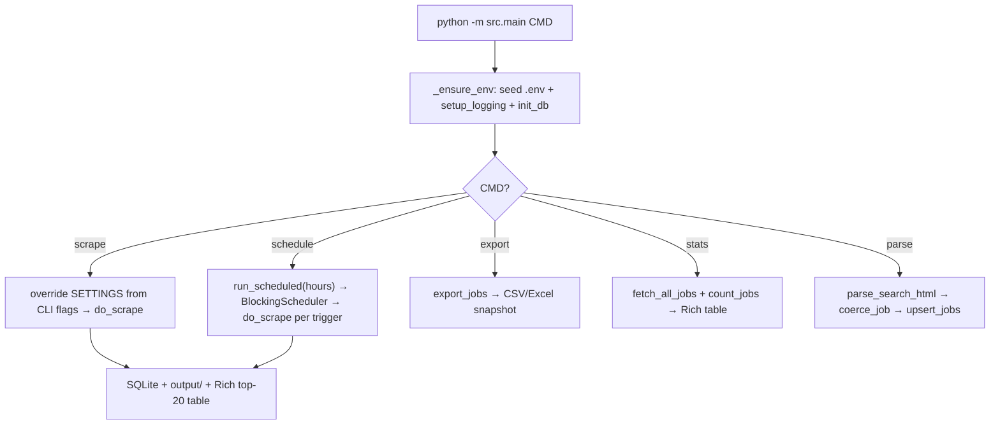
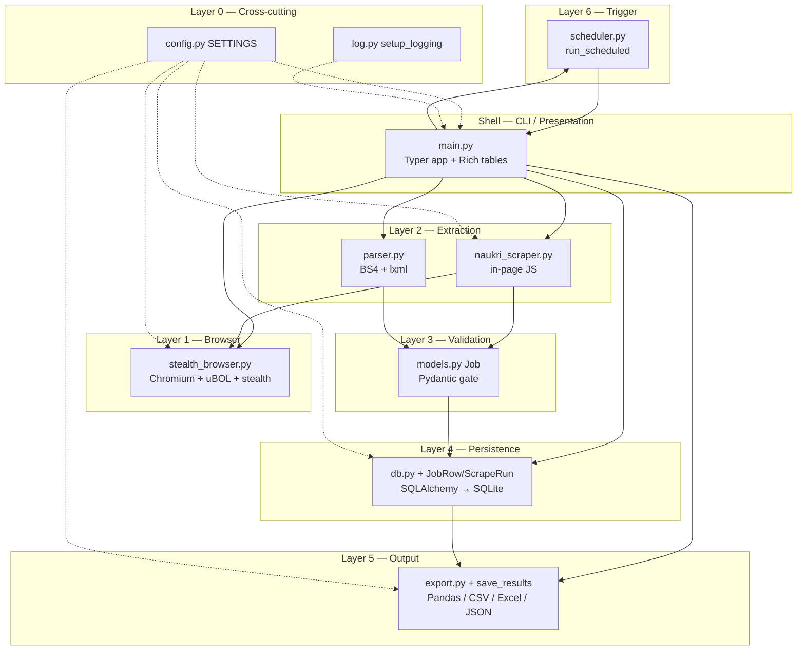
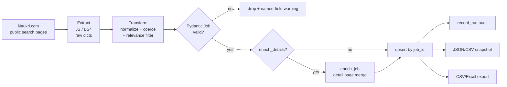
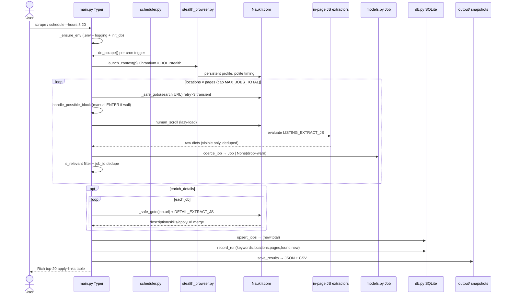
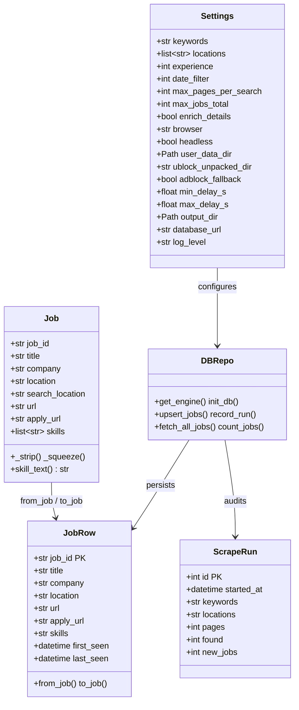
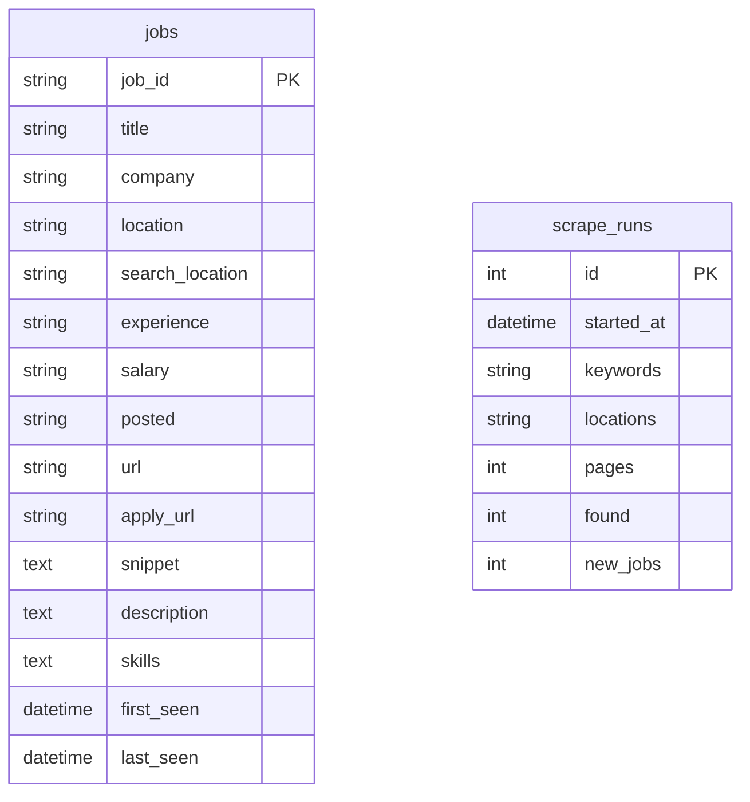
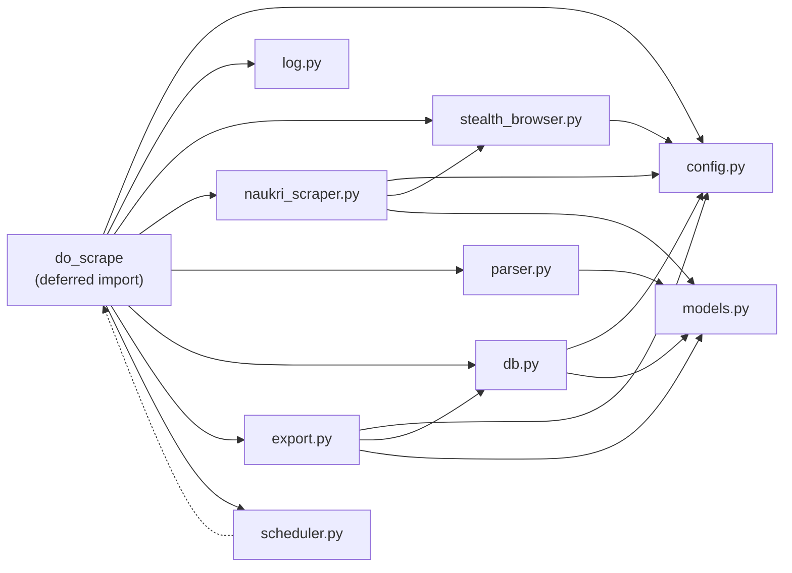
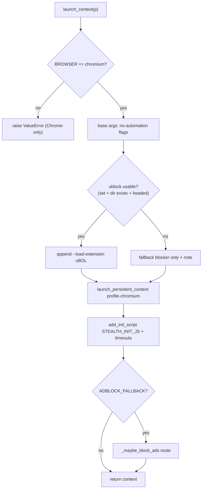
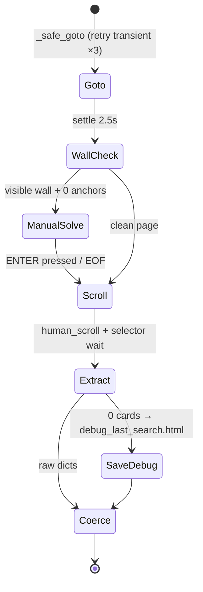

# Full Code Explanation — Secure Naukri.com Jobs Collector

> Companion to `docs/PROJECT.md` (what/why) and `README.md` (how to run).
> This document explains **how the code is written**: code style, architecture
> patterns, design patterns (GoF + non-GoF), project structure, start point,
> endpoints (CLI commands), and module-by-module behavior — with Mermaid diagrams.
>
> Stack: Python + Playwright (Chromium) + uBlock Origin Lite · BeautifulSoup + lxml ·
> Pydantic + SQLAlchemy (SQLite) · Pandas · APScheduler · tenacity · Typer + Rich ·
> std `logging` · python-dotenv. Tests: pytest + pytest-cov, 100% coverage gate.

---

## 1. Project structure (where everything lives)

```
.
├── src/                    # application code (the only importable package)
│   ├── __init__.py
│   ├── main.py             # START POINT — Typer CLI: scrape|export|stats|parse|schedule
│   ├── config.py           # Layer 0 — env-driven SETTINGS singleton
│   ├── log.py              # logging setup (std logging, one call at startup)
│   ├── stealth_browser.py  # Layer 1 — Chromium launcher + uBO Lite + stealth
│   ├── naukri_scraper.py   # Layer 2-live — search URLs, JS extractors, pipeline
│   ├── parser.py           # Layer 2-offline — BS4+lxml twin of the JS extractors
│   ├── models.py           # Layer 3+4 — Pydantic Job + SQLAlchemy JobRow/ScrapeRun
│   ├── db.py               # Layer 4 — engine, sessions, upsert, audit log
│   ├── export.py           # Layer 5 — Pandas CSV/Excel snapshots
│   └── scheduler.py        # Layer 6 — APScheduler daily cron triggers
├── tests/                  # 93 tests, no browser/network (FakePage/FakeContext)
│   ├── conftest.py         # make_job/raw_card/fresh_db + Playwright fakes
│   ├── test_*.py           # one file per src module
├── scripts/                # live practice probes (need real browser/network)
│   ├── practice_tests.py | practice_ecommerce.py | bot_probe.py
├── vendor/                 # uBO Lite unpacked build + download script
├── docs/                   # PROJECT.md, TESTING.md, BOT_DETECTION.md, GRAPHIFY.md
│   └── CODE_EXPLANATION.md # ← this file
├── graphify-out/           # queryable knowledge graph (graphify update .)
├── output/  jobs.db  .pw-profile*/  .env   # runtime artifacts (gitignored)
├── requirements.txt  pyproject.toml  .env.example
└── README.md  AGENTS.md
```

**Dependency rule (strictly one-directional):**

```
main → scheduler → naukri_scraper → stealth_browser
main → parser / export / db → models
everyone → config (SETTINGS) + log
nothing imports main (except scheduler's deferred do_scrape import to avoid a cycle)
```

### Module responsibility matrix

| Layer | Module | Responsibility | Key functions / symbols |
|---|---|---|---|
| 0 config | `config.py` | `.env`-driven `SETTINGS` singleton | `_get/_get_int/_get_float/_get_bool`, `Settings`, `SETTINGS`, `BASE_DIR` |
| util | `log.py` | std-logging setup | `setup_logging` |
| 1 browser | `stealth_browser.py` | Chromium launcher + uBO Lite wiring | `launch_context`, `_launch_chromium`, `_extension_args`, `_maybe_block_ads`, `human_pause`, `STEALTH_INIT_JS`, `BLOCKED_HOSTS` |
| 2 live extract | `naukri_scraper.py` | Search URLs, JS extractors, pipeline | `build_search_url`, `scrape_search_page`, `enrich_job`, `run_scrape`, `save_results`, `coerce_job`, `normalize_raw`, `LISTING_EXTRACT_JS`, `DETAIL_EXTRACT_JS`, `check_bot_wall`, `handle_possible_block`, `human_scroll`, `is_relevant` |
| 2 offline extract | `parser.py` | BS4+lxml twin (no browser) | `parse_search_html`, `parse_detail_html`, `_is_trap`, `_card_text` |
| 3 validate | `models.py` | Pydantic `Job` contract | `Job`, `Job.skill_text` |
| 4 persist | `models.py` + `db.py` | ORM rows + engine/upsert/audit | `JobRow.from_job/to_job`, `ScrapeRun`, `get_engine`, `init_db`, `get_session`, `upsert_jobs`, `record_run`, `fetch_all_jobs`, `count_jobs` |
| 5 output | `export.py` | Pandas CSV/Excel | `load_frame`, `export_jobs`, `COLUMNS` |
| 6 schedule | `scheduler.py` | Daily cron | `run_scheduled` |
| front door | `main.py` | Typer commands + Rich tables | `app`, `do_scrape`, `scrape/export/stats/parse/schedule`, `_ensure_env`, `_print_jobs` |

---

## 2. Start point (how the app boots)

**Entry: `python -m src.main <command>`** → `src/main.py:188-189`:

```python
if __name__ == "__main__":  # `python -m src.main …` entry point
    app()  # Typer dispatches to scrape|export|stats|parse|schedule
```

Boot sequence (every command runs `_ensure_env()` first — `src/main.py:40-53`):

1. Seed `.env` from `.env.example` on first run (convenience copy).
2. `setup_logging(SETTINGS.log_level)` — std logging to stdout, Playwright quieted to WARNING.
3. `init_db()` — `Base.metadata.create_all` (idempotent; creates `jobs` + `scrape_runs`).
4. Command-specific flow (see §3 Endpoints).

The **shared pipeline** `do_scrape()` (`src/main.py:56-81`) is the single funnel used
by both the `scrape` command and the scheduler, so scheduled and manual runs are
byte-identical logic: browser → `run_scrape` → `upsert_jobs` → `record_run` →
`save_results` → Rich table.



---

## 3. Endpoints (CLI commands — this app has no HTTP server)

All commands: `python -m src.main <cmd> --help`. Every command is a Typer
`@app.command()` function in `src/main.py`.

| Endpoint | Signature (defaults from `SETTINGS`/`.env`) | What it does | Writes |
|---|---|---|---|
| `scrape` | `--keywords --locations --experience --days --pages --max-jobs --enrich/--no-enrich --browser --headless` | Full pipeline: `launch_context` → `run_scrape` (collect+validate) → `upsert_jobs` → `record_run` → `save_results` → Rich top-20 | `jobs.db`, `output/naukri_jobs_<ts>.json/.csv` |
| `export` | `--format csv\|excel --location --out` | `export_jobs(fmt, location, out_path)`: SQLite → timestamped snapshot (Pandas) | `output/naukri_export_<ts>.csv/.xlsx` |
| `stats` | (none) | `count_jobs()` + `fetch_all_jobs(5000)` → Rich table of freshest 15 | stdout only |
| `parse` | `HTML_PATH` | Offline: `Path.read_text` → `parse_search_html` → `coerce_job` per card → `upsert_jobs` → Rich table. No browser. | `jobs.db` |
| `schedule` | `--hours 8,20` | `run_scheduled([8,20])`: one cron trigger per hour at `:05`, `max_instances=1`, blocking until Ctrl+C | `jobs.db` + `output/` per trigger |

Exit codes: `0` success (including "0 jobs found" — guidance, not error);
`2` for bad `--format` / bad `--hours`.

---

## 4. Code style (the conventions used everywhere)

1. **PEP 8 + type hints everywhere.** Every `src/*.py` starts with
   `from __future__ import annotations` (lazy annotations, `Job | None`,
   `list[Job]`, `Path | None` work on all supported versions).
   Public functions annotate all args/returns; private helpers too.
2. **Docstring-first modules.** Each file opens with a module docstring stating
   its layer, pipeline position (ASCII diagram), and philosophy
   (e.g. `naukri_scraper.py:1-12`, `stealth_browser.py:1-23`, `parser.py:1-15`,
   `models.py:1-16`). Every public function has Args/Returns docstrings —
   written so `pytest --cov` + readers never need to guess.
3. **Std-lib-only for plumbing.** `logging` (not structlog), `dataclasses`
   (not attrs/pydantic-settings), `pathlib`, `urllib.parse`, `csv/json`,
   `random/time`. Third-party deps are load-bearing only (see §8).
4. **Pure functions where possible.** `build_search_url`, `normalize_raw`,
   `is_relevant`, `parse_search_html`, `_resolve_url` are side-effect-free →
   trivially unit-testable. I/O (browser, DB, files, clock) is pushed to the
   edges (`scrape_search_page`, `upsert_jobs`, `save_results`, `export_jobs`).
5. **Defensive, never crashy.** Env readers fall back to defaults on
   missing/malformed vars (`config.py:30-53`); `enrich_job` returns the original
   job on any failure (`naukri_scraper.py:349-354`); `check_bot_wall` returns
   `False` on JS exceptions; `handle_possible_block` swallows `EOFError`;
   `human_scroll` falls back to JS scroll; debug-HTML save is try/except-pass.
6. **Constants at top, screaming snake.** `BASE_SEARCH`, `BOT_WALL_PATTERNS`,
   `JOB_URL_RE`, `BLOCKED_HOSTS`, `STEALTH_INIT_JS`, `LISTING/DETAIL_EXTRACT_JS`,
   `COLUMNS`, `BASE_DIR`, `SETTINGS`.
7. **Logging, not prints (except UX).** Library modules use
   `log = logging.getLogger(__name__)` + `log.info/warning/error`.
   `print()` appears only for operator UX in `stealth_browser` (`[browser]/[ublock]/[privacy]`
   lines) and Rich tables in `main` (`console.print`).
8. **Tests mirror src 1:1.** `tests/test_<module>.py` per module; shared fakes in
   `conftest.py`; `pyproject.toml` enforces `--cov=src --cov-report=term-missing
   --cov-fail-under=100` (100% gate). No browser/network in tests — `FakePage`,
   `FakeContext`, `FakeBrowserType`, `fresh_db` (tmp SQLite), `monkeypatch`.
9. **Config style.** `config.py` is a `@dataclass Settings` with
   `field(default_factory=…)` for computed values (paths, split lists);
   low-level `_get*` readers tolerate bad input; `SETTINGS` singleton imported
   everywhere; CLI flags overwrite fields per-run (documented as the pattern).
10. **URL canonicalisation is a cross-cutting rule.** Strip `?…` trackers
    (`models.Job._strip`, `naukri_scraper.normalize_raw`, `parser.urljoin+split`),
    absolutise relative hrefs, dedupe by numeric `job_id` regex
    `/job-listings-[\w\-]+-(\d+)` — same regex in JS, Python-live, and BS4 paths.

---

## 5. Architecture patterns

### 5.1 Layered architecture (the backbone)

Six strict layers + CLI shell; dependencies point inward/downward only.



### 5.2 ETL / pipeline pattern

The whole app is an **Extract → Transform → Load** pipeline with a validation gate:

```
Extract   = Playwright + JS (live)  |  BS4+lxml (offline twin)
Transform = normalize_raw + coerce_job + is_relevant + enrich_job
Load      = upsert_jobs + record_run (SQLite) + save_results/export_jobs (files)
```

Invariants: SQLite is source of truth; files are disposable snapshots;
`job_id` is the dedupe key end-to-end; retries are transient-only.



### 5.3 Modular monolith, CLI-first (no server, no microservices)

One process, one package, five entry verbs. Chosen deliberately: personal-use,
single-user, local DB, cron-style scheduling. No HTTP layer, no background
workers, no message bus — APScheduler's `BlockingScheduler` is the only
"server-like" loop, and it just re-invokes `do_scrape`.

### 5.4 Repository / DAO (data-access encapsulation)

`src/db.py` is the sole gateway to storage: `init_db`, `upsert_jobs`,
`record_run`, `fetch_all_jobs`, `count_jobs`, `get_session`, `get_engine`.
No raw SQL anywhere (dialect-agnostic SQLAlchemy `select()`), so `DATABASE_URL`
can flip to Postgres with zero code change. Callers never touch sessions
except through these functions (tests use `get_session` only to assert).

### 5.5 Other architectural idioms

- **Configuration-as-singleton** (`SETTINGS`): one env-resolved object injected
  by import + `monkeypatch` in tests.
- **Audit-logging**: every run appends to `scrape_runs` (who/what/when/how-many).
- **Snapshot pattern**: timestamped `naukri_jobs_<ts>.json/.csv` and
  `naukri_export_<ts>.csv/.xlsx` are point-in-time copies; DB stays canonical.
- **Politeness / rate-limiting as architecture**: caps (`MAX_PAGES`, `MAX_JOBS`),
  randomised `human_pause`, scroll-settle waits, `max_instances=1` — anti-ban is
  structural, not an afterthought.
- **Offline-twin / dual-extraction**: live JS and BS4 parsers implement the same
  contract (raw dicts → `coerce_job`), so debugging never re-hits the site.

---

## 6. Design patterns — GoF catalog (with file:line evidence)

| # | GoF pattern | Where | How |
|---|---|---|---|
| 1 | **Singleton** | `config.py:112` (`SETTINGS`), `db.py:25-26,41-49` (engine + session factory cache) | One process-wide settings object; one lazily-created engine. Tests reset via `fresh_db` / `monkeypatch`. |
| 2 | **Factory Method** | `models.py:110-127` (`JobRow.from_job`), `conftest.py:19-43` (`make_job`, `raw_card`) | Encapsulated construction: ORM row from domain model; valid test fixtures from defaults+overrides. |
| 3 | **Adapter** | `naukri_scraper.py:245-268` (`normalize_raw`), `models.py:129-145` (`to_job`) | Adapts in-page camelCase (`jobId`, `applyUrl`) → snake_case `Job`; adapts flat DB row ⇄ rich `Job`. |
| 4 | **Facade** | `main.py:56-81` (`do_scrape`), `stealth_browser.py:178-191` (`launch_context`) | `do_scrape` hides browser+scrape+upsert+audit+snapshot+print behind one call; `launch_context` hides profile+args+stealth+blocker. |
| 5 | **Strategy** | `naukri_scraper.LISTING_EXTRACT_JS` vs `parser.parse_search_html` | Two interchangeable extraction strategies (computed-style JS vs static BS4) behind the same raw-dict contract. |
| 6 | **Template Method** | `parser.py:87-129` + `132-166` | `parse_search_html` / `parse_detail_html` share the skeleton (select anchors → trap-check → regex id → dedupe/merge); steps vary. Same shape in JS extractors. |
| 7 | **Decorator** (retry) | `naukri_scraper.py:286-291` (`_safe_goto = retry(…)(lambda…)`) | tenacity decorates `goto` with retry-on-transient + exponential backoff (max 3). Declarative, non-invasive. |
| 8 | **Command** | `main.py:97-185` (`@app.command()` ×5) | Each CLI verb is a Command object (Typer): receiver (`do_scrape`/export fns), invoker (Typer), parameters (options). Scheduler re-invokes the same command. |
| 9 | **Observer** (cron flavor) | `scheduler.py:24-43` | `BlockingScheduler` + `CronTrigger(hour, :05)` observes wall-clock and notifies `do_scrape` subscribers. |
| 10 | **Iterator** | `db.py:114-120` (`fetch_all_jobs`), `export.py:29-47` (`load_frame`) | Freshest-first row iteration (`ORDER BY last_seen DESC LIMIT`) surfaced as `list[Job]` / `DataFrame`. |
| 11 | **Null-Object-ish / Graceful-degradation returns** | `naukri_scraper.py:271-278` (`coerce_job → None`), `323-354` (`enrich_job → original`) | Invalid cards become `None` (caller skips); failed enrichment returns the un-enriched job — one bad card/page never kills a run. |
| 12 | **Proxy** (protection) | `stealth_browser.py:93-113` (`_maybe_block_ads` route handler) | Playwright route intercepts every request and aborts tracker/ad hosts — a protection proxy in front of the network. |

### Non-GoF / idiomatic patterns used

| Pattern | Where | Notes |
|---|---|---|
| ETL pipeline | §5.2 | extract→transform→load with validation gate |
| Upsert / idempotent write | `db.py:66-102` | insert-or-refresh on `job_id` PK; `first_seen`/`last_seen` powers "new since yesterday" |
| Validation gate | `models.py:29-72` | Pydantic `Job` (`min_length`, `_strip`, `_squeeze`) drops junk with a named-field warning |
| Dual-write (DB + snapshot) | `main.do_scrape`, `export.export_jobs` | canonical store + disposable files |
| Manual-gate for bot-walls | `naukri_scraper.py:198-212` | pause-for-ENTER instead of CAPTCHA solving (ethical stance, see `docs/BOT_DETECTION.md`) |
| Honeypot-guard extraction | `LISTING_EXTRACT_JS`, `parser._is_trap` | skip `display:none`/`aria-hidden`/href-traps/0-size/off-screen; dedupe by id |
| Test Doubles (Fake/Mock/Stub) | `tests/conftest.py:69-231` | `FakePage/Context/BrowserType/Route/Mouse` — full pipeline at 100% coverage with no browser |
| Dependency injection (test seam) | `monkeypatch.setattr(SETTINGS, …)`, `fresh_db` | config + engine swapped per-test; `_ensure_env(base_dir)` parameterised for tmp dirs |
| Layered init script | `STEALTH_INIT_JS` | hides `webdriver`, stubs `chrome`/permissions at document-start |
| Deferred import (cycle-breaker) | `scheduler.py:32`, `main.py:157-158,184` | `from .main import do_scrape` inside function; parser/scheduler imports inside commands |

**Deliberately NOT used:** Abstract Factory / Builder (no product families need
them), Visitor (no AST Morgenstern), Flyweight/Prototype (no memory pressure),
microservices/event-bus/CQRS (overkill for a single-user collector), ORM
migrations framework (SQLite `create_all` suffices; Postgres later needs none
of this code changed).

---

## 7. Module-by-module explanation

### `config.py` — Layer 0, env-driven settings
`load_dotenv()` at import → `_get*` tolerant readers → `@dataclass Settings`
(grouped: search profile / browser / blocking / politeness / outputs /
persistence) → `SETTINGS` singleton. `BASE_DIR` anchors relative
`sqlite:///jobs.db`, profile, and output paths so the app runs from any CWD.
CLI flags in `main.scrape` overwrite fields per-run; tests `monkeypatch` them.

### `log.py` — one-call logging
`setup_logging(level)`: `basicConfig(force=True)` to stdout,
`HH:MM:SS LEVEL logger: message`; unknown levels → INFO; Playwright logger
pinned to WARNING. Library modules only do `getLogger(__name__)`.

### `stealth_browser.py` — Layer 1, Chromium launcher
Five sub-layers: (1) persistent profile (`<user_data_dir>-chromium`, cookies
survive); (2) uBO Lite via `--load-extension` (headed only — headless-shell
can't load extensions); (3) fallback route-blocker (`BLOCKED_HOSTS` + pixel/
track/beacon media); (4) `STEALTH_INIT_JS` (webdriver-undefined, plugins,
chrome-stub, permissions, deviceMemory); (5) hardened prefs (DNT, locale/
timezone, timeouts). `human_pause(a,b)` = randomised politeness sleep.
`launch_context` raises `ValueError` for non-chromium (Firefox engines die on
spawn here — verified, documented).

### `naukri_scraper.py` — Layer 2-live, the pipeline core
- `build_search_url` — stable `/jobs?k&l&experience&jobPostDate&page` builder.
- `LISTING_EXTRACT_JS` / `DETAIL_EXTRACT_JS` — in-page extractors with
  computed-style visibility guards + `jobId` dedupe (note the `window.location`
  TDZ comment — a real bug that once zeroed results).
- `check_bot_wall` / `handle_possible_block` — visible-text + anchor-count
  detection; manual ENTER-solve, never bypass.
- `human_scroll` — wheel + settle + wiggle (lazy-load trigger), JS fallback.
- `is_relevant` — high-recall `.NET` keyword gate.
- `normalize_raw` → `coerce_job` — camelCase→snake, URL canon, length caps,
  Pydantic validate-or-`None`-with-warning.
- `_safe_goto` — tenacity retry on **both** `TimeoutError`s (builtin +
  Playwright's own), 3 attempts, exponential backoff; never retries 403/429.
- `scrape_search_page` — goto → settle → wall-check → scroll → selector-wait →
  evaluate; zero cards → save `output/debug_last_search.html` for offline `parse`.
- `enrich_job` — detail visit + field merge (unknown keys ignored, empty
  `apply_url` falls back); any failure returns the original.
- `run_scrape` — locations × pages collection with dedupe + cap + politeness,
  then optional enrichment pass; returns `list[Job]`.
- `save_results` — timestamped JSON + CSV into `output/`.

### `parser.py` — Layer 2-offline, BS4 twin
`parse_search_html` / `parse_detail_html` re-implement the JS extractors from
static markup (inline-style + `aria-hidden` + href-trap checks, 3-ancestor walk,
regex id, dedupe). `_is_trap` + `_card_text` are the shared primitives.
Entry for `main parse`; dev loop without re-hitting Naukri.

### `models.py` — Layers 3+4, the data contract
`Job` (Pydantic): `job_id` (min 3) + `title` (min 4) required; everything else
defaults to `""`/`[]`; `_strip` (URL canon) + `_squeeze` (whitespace collapse)
validators; `skill_text()` joins for storage. `JobRow` (SQLAlchemy `jobs`
table: PK `job_id`, flat text columns, `first_seen`/`last_seen` server defaults)
+ `from_job`/`to_job` converters. `ScrapeRun` (`scrape_runs` audit table).
Two-model rationale is documented in the module docstring.

### `db.py` — Layer 4, repository
`_resolve_url` (relative-sqlite→absolute), `get_engine` (lazy singleton +
`sessionmaker`), `init_db` (idempotent `create_all`), `get_session`,
`upsert_jobs` (insert-or-refresh + `last_seen=now()`, returns `(new,total)`),
`record_run` (audit append), `fetch_all_jobs` (freshest-first, re-validated to
`Job`), `count_jobs`. No raw SQL — Postgres-ready.

### `export.py` — Layer 5, Pandas snapshots
`load_frame(location, limit)` — `read_sql(select(JobRow)…)` + dual-column
location filter (`location` OR `search_location`), stable `COLUMNS` order.
`export_jobs(fmt, location, out_path)` — CSV (default) or Excel via openpyxl,
timestamped under `OUTPUT_DIR` unless explicit path. Read-only vs the DB.

### `scheduler.py` — Layer 6, cron
`run_scheduled(hours)` — one `CronTrigger(hour, minute=5)` job per hour,
`max_instances=1`, `BlockingScheduler.start()` until Ctrl+C. Deferred
`from .main import do_scrape` avoids the main↔scheduler cycle. Scheduling
changes *when*, never *how aggressively*.

### `main.py` — shell, front door
Typer `app` + shared `console`; `_ensure_env` (dotenv seed + logging + DB);
`do_scrape` (shared funnel); `_print_jobs` (Rich table); five commands (§3).
CLI flags override `SETTINGS` per-run only.

---

## 8. Dependencies (why each exists)

| Package | Used in | Why (no substitutes) |
|---|---|---|
| `playwright` | browser launch + scrape | real Chromium automation; persistent profiles + extensions |
| `beautifulsoup4` + `lxml` | offline parse | fast static-HTML twin, no browser |
| `pydantic` | validation gate | typed contract, named-field errors |
| `sqlalchemy` | persistence | dialect-agnostic ORM, upsert, Postgres-ready |
| `pandas` + `openpyxl` | exports | DataFrame filter + CSV/Excel |
| `apscheduler` | scheduling | cron triggers, `max_instances=1` |
| `tenacity` | retries | transient-only retry + backoff as decorator |
| `python-dotenv` | config | `.env` → `os.environ` |
| `typer` + `rich` | CLI/UX | commands = Command pattern; tables/status |
| `pytest` + `pytest-cov` | tests | fakes + 100% gate |

Excluded on purpose: Selenium/Scrapy, undetected-chromedriver,
fingerprint-spoofing, proxies, CAPTCHA solvers (see README §4).

---

## 9. Mermaid diagrams (detail)

### 9.1 Full data-flow (browser → DB → files)



### 9.2 Class / data-model diagram



### 9.3 Database ER



### 9.4 Module dependency graph



### 9.5 Browser-launch decision flow



### 9.6 Bot-wall / politeness state



---

## 10. Testing architecture (why 100% is feasible)

- **Fakes, not mocks-framework:** `FakePage` dispatches `evaluate()` on markers
  in the real JS strings (`const out = [];` = listing, `applyUrl` = detail),
  so tests exercise the real call sequence. `goto_plan` scripts transient
  failures for tenacity tests; `mouse_fail`/`selector_fail`/`content_fail`
  cover every fallback branch.
- **`fresh_db` fixture:** tmp-file SQLite + engine-global reset before/after —
  each DB test is hermetic.
- **`monkeypatch` as DI:** `SETTINGS` fields, `human_pause`, `input`, output
  dirs swapped per-test, auto-undone.
- **Gate:** `pyproject.toml` → `pytest --cov=src --cov-fail-under=100`; every
  `except`/`if-not` branch has a named test (e.g. TDZ regression,
  Playwright-vs-builtin `TimeoutError`, `close_fail`, unknown detail keys).

---

## 11. Knowledge graph + living docs

- `graphify-out/` (graph.html, GRAPH_REPORT.md, graph.json) is the queryable
  map: `graphify query "<q>"` before grepping; `graphify path A B` for
  relationships; `graphify explain <concept>` for focused subgraphs.
- After **any** code change: `graphify update .` (AST-only, free).
- This file + `PROJECT.md` + `GRAPHIFY.md` + `TESTING.md` + `BOT_DETECTION.md`
  are the doc set; README stays the 2-minute quickstart.

## 12. Fair use (binding)

Public listings only, polite rate limits, personal job search. Respect
Naukri's ToS / `robots.txt`; never share/sell data or run concurrent workers.
On block pages: back off and retry later — never bypass.
